# 25 AI Agents: Excalidraw to Linear

> Inside the [Delivery Systems Engineering](../../README.md) portfolio · *Multi-project, multi-team customer engagements built to scale from one client to many.*

## Overview

I'm building a 25-agent pipeline that uses Obsidian as a local-first vault to transform Excalidraw canvases into stakeholder-ready deliverables and Linear work items. The objective is to create a repeatable workflow that moves ideas from visual brainstorming into structured execution without losing context, traceability, or implementation intent.

This project focuses on closing the gap between ideation and delivery through a client-agnostic architecture built around shared files, governance standards, and AI-assisted orchestration. By distributing responsibilities across specialized agents, the system can process strategic, tactical, and operational inputs while maintaining a consistent output format. The result is a workflow where concepts captured on a canvas become documented decisions, actionable plans, and development-ready tickets that can move directly into execution.

The architecture is built across **9 phases**, anchored by **The Vision: Building a Canvas-Driven Agentic Delivery System** on the input side and **3-Model Triangulation and System Scorecard** at the end. Each phase is listed in the Implementation section below.

## Architecture

```mermaid
---
title: 25-Agent Canvas-to-Linear Delivery Pipeline
---
%%{init: {"theme":"base","themeVariables": {"primaryColor":"#1B4332","primaryTextColor":"#F4D03F","primaryBorderColor":"#F4D03F","secondaryColor":"#264653","tertiaryColor":"#2F5233","lineColor":"#F4D03F","fontFamily":"ui-monospace, SFMono-Regular, Menlo, Consolas, monospace","fontSize":"13px"}}}%%
flowchart LR
    classDef datastore fill:#264653,stroke:#F4D03F,stroke-width:2px,color:#FFFFFF
    classDef service fill:#1B4332,stroke:#F4D03F,stroke-width:2px,color:#F4D03F
    classDef event fill:#7B42BC,stroke:#F4D03F,stroke-width:2px,color:#FFFFFF
    classDef io fill:#0d1117,stroke:#F4D03F,stroke-width:1.5px,color:#F4D03F,font-style:italic

    Operator[/"Operator (council facilitator)"/]
    LinearWorkspace[/"Linear workspace + Q3 2026 Delivery Pipeline Initiative"/]

    subgraph Toolchain["Local Toolchain"]
        Node("Node.js")
        ClaudeDesktop("Claude Desktop")
        ClaudeCode("Claude Code 2.1.123")
        Codex("Codex CLI 0.122.0")
        Gemini("Gemini")
        ObsidianVault("Obsidian IdeationCouncil vault")
        ExcalidrawPlugin("Excalidraw plugin")
        Dataview("Dataview + Templater + Git")
    end

    subgraph ClientAgnosticADR["Client-Agnostic ADR-003"]
        AgentsAsMarkdown[(Agents as plain Markdown templates)]
        ProjectMCPConfig[(.mcp.json: project-level MCP)]
        SystemMCPConfig[(Claude Desktop system MCP)]
        Portability{{"Vault owns state; clients are interchangeable"}}
    end

    subgraph MCPLayer["MCP Connectivity Layer"]
        FilesystemMCP("filesystem MCP: vault read/write")
        LinearMCP("Linear MCP: ticket + project + initiative")
    end

    subgraph TwentyFiveAgents["25 Agents Across 5 Teams"]
        CouncilLead("Council Lead: orchestration + gates")
        TeamC("Team C: Visual Ideation Engine")
        TeamA("Team A: Intelligence research")
        TeamB("Team B: Adversarial review")
        TeamD("Team D: Synthesis")
        TeamE("Team E: Delivery bridge to Linear")
    end

    subgraph CanvasTemplates["Excalidraw Canvas Templates"]
        Brainstorm("Brainstorm canvas")
        Planning("Planning canvas")
        Review("Review canvas")
        DeliveryCanvas("Delivery canvas")
    end

    subgraph GovernanceLayer["Vault-Resident Governance"]
        BrainstormBible[(brainstorm-bible.yaml)]
        CycleYaml[(cycle.yaml)]
        SystemsIdentity[(delivery-systems-identity.yaml)]
        DriftDetection[(drift-detection.yaml)]
        Playbooks[(supporting playbooks)]
    end

    subgraph CouncilSessions["3 Real-World Council Sessions"]
        SessionA("Session A: Cloud Modernization")
        SessionB("Session B: Newsletter Strategy")
        SessionC("Session C: AI-Native Transformation")
        VaultHandoff{{"Vault as handoff layer between Claude / Gemini / Codex"}}
    end

    subgraph DeliverableArtifacts["Stakeholder Deliverables"]
        ADRs[(ADRs)]
        MermaidDiagrams[(Mermaid diagrams)]
        ImplPlans[(Phased implementation plans)]
        StakeholderDocs[(Stakeholder briefs)]
    end

    subgraph LinearShipping["Linear Ticket Shipping"]
        StandardsGate{{"Standards-gate review"}}
        TicketCreation("Ticket creation per session")
        Session30Tickets[(30 total tickets: 12 / 8 / 10)]
        InitiativeRollup[(Q3 2026 Delivery Pipeline Initiative)]
        OrphanCheck{{"Orphan verification: only Linear onboarding tickets unlinked"}}
    end

    subgraph TriangulationReview["3-Model Triangulation Review"]
        CodexAttack("Codex: attack reviews + spot checks")
        ClaudeValidate("Claude: validation against source artifacts")
        GeminiCross("Gemini: cross-validation activities")
        FinalScore[/"98/100, 19 of 20 requirements pass"/]
    end

    Operator --> Toolchain
    Operator --> ObsidianVault
    ExcalidrawPlugin --> ObsidianVault
    ClaudeCode -.client-agnostic.-> AgentsAsMarkdown
    Codex -.client-agnostic.-> AgentsAsMarkdown
    Gemini -.client-agnostic.-> AgentsAsMarkdown
    Portability -.architectural objective.-> AgentsAsMarkdown
    ProjectMCPConfig --> FilesystemMCP
    ProjectMCPConfig --> LinearMCP
    SystemMCPConfig --> FilesystemMCP
    FilesystemMCP --> ObsidianVault
    LinearMCP --> LinearWorkspace

    ObsidianVault --> CanvasTemplates
    ObsidianVault --> GovernanceLayer
    ObsidianVault --> TwentyFiveAgents

    BrainstormBible -.standards.-> CouncilLead
    CycleYaml -.cadence.-> CouncilLead
    SystemsIdentity -.identity.-> CouncilLead
    DriftDetection -.drift gate.-> CouncilLead
    Playbooks -.procedures.-> CouncilLead

    CouncilLead --> TeamC
    TeamC --> CanvasTemplates
    CanvasTemplates --> TeamA
    CanvasTemplates --> TeamB
    TeamA --> TeamD
    TeamB --> TeamD
    TeamD --> TeamE
    TeamE --> DeliverableArtifacts

    DeliverableArtifacts --> SessionA
    DeliverableArtifacts --> SessionB
    DeliverableArtifacts --> SessionC
    VaultHandoff -.preserves continuity.-> CouncilSessions

    SessionA --> StandardsGate
    SessionB --> StandardsGate
    SessionC --> StandardsGate
    StandardsGate --> TicketCreation
    TicketCreation --> Session30Tickets
    Session30Tickets --> InitiativeRollup
    InitiativeRollup --> LinearWorkspace
    OrphanCheck -.verification.-> Session30Tickets

    CodexAttack --> ClaudeValidate
    ClaudeValidate --> GeminiCross
    GeminiCross --> FinalScore
    Session30Tickets -.scored by.-> CodexAttack

    class Node,ClaudeDesktop,ClaudeCode,Codex,Gemini,ObsidianVault,ExcalidrawPlugin,Dataview service
    class FilesystemMCP,LinearMCP service
    class CouncilLead,TeamA,TeamB,TeamC,TeamD,TeamE service
    class Brainstorm,Planning,Review,DeliveryCanvas service
    class SessionA,SessionB,SessionC,TicketCreation,CodexAttack,ClaudeValidate,GeminiCross service
    class AgentsAsMarkdown,ProjectMCPConfig,SystemMCPConfig,BrainstormBible,CycleYaml,SystemsIdentity,DriftDetection,Playbooks datastore
    class ADRs,MermaidDiagrams,ImplPlans,StakeholderDocs,Session30Tickets,InitiativeRollup datastore
    class Portability,VaultHandoff,StandardsGate,OrphanCheck event
    class Operator,LinearWorkspace,FinalScore io
```

The diagram shows the topology and data flow of the system as built. The full architectural narrative, with screenshots and prose, lives in [`documents/25-agent-canvas-to-linear.md`](./documents/25-agent-canvas-to-linear.md).

## Implementation

This system is built across **9 phases**:

1. **The Vision: Building a Canvas-Driven Agentic Delivery System**
2. **Setting Up the Toolchain and Workspace**
3. **Designing the System Before Building It**
4. **Wiring MCP Servers and Configuring Linear**
5. **Deploying 25 Agents Across 5 Teams**
6. **Building Excalidraw Canvas Templates and Governance**
7. **Running 3 Real-World Council Sessions**
8. **Shipping to Linear and Validating All Deliverables**
9. **3-Model Triangulation and System Scorecard**

For the full walkthrough with screenshots and step-by-step content, see [`documents/25-agent-canvas-to-linear.md`](./documents/25-agent-canvas-to-linear.md).

## Validation

Build outcomes verified end-to-end. Each phase below is captured with screenshots, configuration, and observable behavior in [`documents/25-agent-canvas-to-linear.md`](./documents/25-agent-canvas-to-linear.md):

- ✅ The Vision: Building a Canvas-Driven Agentic Delivery System
- ✅ Setting Up the Toolchain and Workspace
- ✅ Designing the System Before Building It
- ✅ Wiring MCP Servers and Configuring Linear
- ✅ Deploying 25 Agents Across 5 Teams
- ✅ Building Excalidraw Canvas Templates and Governance
- ✅ Running 3 Real-World Council Sessions
- ✅ Shipping to Linear and Validating All Deliverables
- ✅ 3-Model Triangulation and System Scorecard
