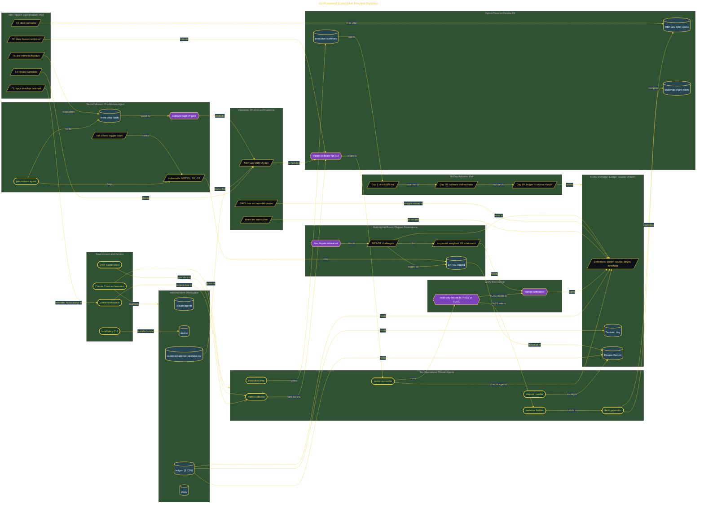

# AI-Powered Executive Review System

> Inside the [Delivery Systems Engineering](../../README.md) portfolio · *Multi-project, multi-team customer engagements built to scale from one client to many.*

## Overview

This project builds an AI-native executive review system for portfolio reporting. The system was built around Claude Code, Linear access, OKR tracking, Marp deck generation, a metric-definition ledger, and a local cadence structure.

The goal was to create an operating model where executive metrics could be collected, checked, challenged, and presented without losing traceability. The system focused on making every number defensible before it reached an MBR or QBR deck.

A key constraint surfaced early. The workspace had a local cadence file, but no recurring calendar events had actually been created. That mattered because the review system could describe the cadence, but the calendar-based workflow still needed an explicit setup step before it could run as a real standing process.

The architecture is built across **7 phases**, anchored by **Building an AI-Native Executive Review Operating System** on the input side and **Secret Mission: Pre-Mortem Agent for Proactive Dispute Defense** at the end. Each phase is listed in the Implementation section below.

## Architecture

The diagram shows the topology and data flow of the system as built. The full architectural narrative, with screenshots and prose, lives in [`documents/ai-executive-review-system.md`](./documents/ai-executive-review-system.md).

## Implementation

This system is built across **7 phases**:

1. **Building an AI-Native Executive Review Operating System**
2. **Wiring the Environment and Metric Governance Foundation**
3. **Designing the Agent Architecture**
4. **Designing the Operating Rhythm and Cadence**
5. **Assembling the Agent-Powered Review Kit**
6. **Holding the Room: Live Dispute and Decision Governance**
7. **Secret Mission: Pre-Mortem Agent for Proactive Dispute Defense**

For the full walkthrough with screenshots and step-by-step content, see [`documents/ai-executive-review-system.md`](./documents/ai-executive-review-system.md).

## Validation

Each build phase below is documented in [`documents/ai-executive-review-system.md`](./documents/ai-executive-review-system.md), with screenshots, configuration, and notes as captured during the build:

- ✅ Building an AI-Native Executive Review Operating System
- ✅ Wiring the Environment and Metric Governance Foundation
- ✅ Designing the Agent Architecture
- ✅ Designing the Operating Rhythm and Cadence
- ✅ Assembling the Agent-Powered Review Kit
- ✅ Holding the Room: Live Dispute and Decision Governance
- ✅ Secret Mission: Pre-Mortem Agent for Proactive Dispute Defense
