# Cross-Program Capacity Planning

> Inside the [Delivery Systems Engineering](../../README.md) portfolio · *Multi-project, multi-team customer engagements built to scale from one client to many.*

## Overview

I built a cross-program capacity planning system for a VP of Engineering. The system measures delivery capacity in competent hours rather than headcount. It was designed to show whether the portfolio had enough proven capability to meet dated demand across its programs.

Headcount failed because it treated every assigned person as equal capacity. It did not account for skill level, supporting evidence, or the time required for a new hire or trainee to become competent. That made delivery gaps invisible even when the roster looked fully staffed.

Competent hours corrected the unit of measurement. The model counted capacity only where a person had evidence for the required skill and could contribute within the milestone horizon.

The architecture is built across **7 phases**, anchored by **Defining the Mandate: Why Headcount Failed** on the input side and **Executive Presentation: Lessons Learned and the Adoption Metric** at the end. Each phase is listed in the Implementation section below.

## Architecture

```mermaid
---
title: Cross-Program Capacity Planning
---
%%{init: {"theme":"base","themeVariables": {"primaryColor":"#1B4332","primaryTextColor":"#F4D03F","primaryBorderColor":"#F4D03F","secondaryColor":"#264653","tertiaryColor":"#2F5233","lineColor":"#F4D03F","fontFamily":"ui-monospace, SFMono-Regular, Menlo, Consolas, monospace","fontSize":"13px"}}}%%
flowchart LR
    classDef datastore fill:#264653,stroke:#F4D03F,stroke-width:2px,color:#FFFFFF
    classDef service fill:#1B4332,stroke:#F4D03F,stroke-width:2px,color:#F4D03F
    classDef event fill:#7B42BC,stroke:#F4D03F,stroke-width:2px,color:#FFFFFF
    classDef io fill:#0d1117,stroke:#F4D03F,stroke-width:1.5px,color:#F4D03F,font-style:italic

    VP[/VP of Engineering asking if the portfolio can deliver/]
    Finance[/Finance reading a resource request/]
    Sponsor[/Sponsor receiving a defensible number/]

    subgraph Mandate["The unit is the mandate"]
        Headcount{{Headcount treats every assigned person as equal capacity}}
        Invisible{{Gaps stay invisible while the roster looks fully staffed}}
        CompetentHours[(Competent hours: capacity only where evidence exists)]
    end

    subgraph Commitments["Three commitments, written before any number"]
        ADRs[(Architecture Decision Records)]
        C1{{Evidence-based skills: a self-rating creates no capacity}}
        C2{{Every route respects its need-by date}}
        C3{{Competent hours, never whole people}}
    end

    subgraph Constraints["Day-one constraint statement"]
        Statement[(constraint-statement.md: 5 sections, 4 explicit TBDs)]
        Unproven{{Any unfilled constraint stays UNPROVEN and cannot enter a calculation}}
        NoZeros{{Stops a TBD silently becoming a zero}}
    end

    subgraph Matrix["Skills matrix and evidence audit"]
        Manifest[(Manifest: 3 people, 4 skills, 12 person-skill keys)]
        Audit(Evidence audit against shipped artifacts)
        Thin{{8 of 12 keys UNPROVEN, API Design and Data Engineering hold none}}
    end

    subgraph Routing["Gap routing"]
        Gaps[(8 dated gaps)]
        SingleRoute{{One buy, build or borrow per gap, never several}}
        Arithmetic(forecast start 4 wks plus TTC against need-by)
        TooLate{{Data Engineering needs 28 weeks against an 18-week deadline}}
        Rerouted[(G02 to buy, G05 and G06 to borrow)]
    end

    subgraph Ledger["Capacity in competent hours"]
        Nominal[(3120 nominal hours)]
        Zeroed[(1560 hours at competence factor 0.00)]
        TwoX{{Headcount overstates capability by exactly 2 times}}
    end

    subgraph Attrition["Departure scenarios, same definitions"]
        Scenario(Remove one person, recalculate)
        MitigateOrSlip{{Every loss owes a named mitigation or a forecasted slip}}
        Concentration{{Losing any one of three people costs a third to a half of capability}}
    end

    subgraph Guard["The guard that makes absence mean something"]
        Checks(Three validation checks)
        ReadCount{{Read count must be non-zero AND equal expected}}
        EmptyTrap{{Zero rows read makes any absence claim vacuously true}}
        Record[(One master record, expected counts declared once as 3/4/12/8/4)]
    end

    subgraph Honest["Stated boundaries"]
        NoRetention{{Cannot claim an approached engineer stays}}
        NoRatify{{Cannot claim ratification latency, approvals still queued}}
        Corrected{{Two supplied claims retracted: no real slip occurred, roster is 3 not 13}}
        Forecast{{75% assumes 5 builds land, 1 hire fills, 2 contractors engage}}
    end

    VP -- "rejects" --> Headcount
    Headcount -- "produces" --> Invisible
    Invisible -- "corrected by" --> CompetentHours
    VP -- "commits first through" --> ADRs
    ADRs -- "declares" --> C1
    ADRs -- "declares" --> C2
    ADRs -- "declares" --> C3
    ADRs -- "instantiated as" --> Statement
    Statement -- "marks every blank" --> Unproven
    Unproven -- "enforces" --> NoZeros
    C1 -- "governs" --> Audit
    Manifest -- "audited by" --> Audit
    Audit -- "exposes" --> Thin
    Thin -- "becomes" --> Gaps
    Gaps -- "each takes" --> SingleRoute
    C2 -- "tested by" --> Arithmetic
    Arithmetic -- "on 3 of 8 gaps returns" --> TooLate
    TooLate -- "forces" --> Rerouted
    SingleRoute -- "keeps ownership clear in" --> Rerouted
    C3 -- "converts the roster into" --> Nominal
    Nominal -- "of which" --> Zeroed
    Zeroed -- "yields" --> TwoX
    CompetentHours -- "is the unit behind" --> TwoX
    Scenario -- "reuses the same definitions as" --> Nominal
    Scenario -- "owes" --> MitigateOrSlip
    MitigateOrSlip -- "reveals" --> Concentration
    Checks -- "bound by" --> ReadCount
    ReadCount -- "closes" --> EmptyTrap
    Checks -- "reconciled in" --> Record
    Record -- "makes the three jointly admissible for" --> Sponsor
    TwoX -- "gives finance a dated basis instead of a plea" --> Finance
    Rerouted -- "shows the mechanism, not just the gap, to" --> Finance
    Concentration -- "reported to" --> Sponsor
    NoRetention -- "bounds the claim to" --> Sponsor
    NoRatify -- "bounds the claim to" --> Sponsor
    Corrected -- "removed before presenting to" --> Sponsor
    Forecast -- "labelled unproven for" --> Sponsor

    class CompetentHours,ADRs,Statement,Manifest,Gaps,Rerouted,Nominal,Zeroed,Record datastore
    class Audit,Arithmetic,Scenario,Checks service
    class Headcount,Invisible,C1,C2,C3,Unproven,NoZeros,Thin,SingleRoute,TooLate,TwoX,MitigateOrSlip,Concentration,ReadCount,EmptyTrap,NoRetention,NoRatify,Corrected,Forecast event
    class VP,Finance,Sponsor io
```

The diagram shows the topology and data flow of the system as built. The full architectural narrative, with screenshots and prose, lives in [`documents/cross-program-capacity-planning.md`](./documents/cross-program-capacity-planning.md).

## Implementation

This system is built across **7 phases**:

1. **Defining the Mandate: Why Headcount Failed**
2. **Locking Design Commitments, ADRs, and the System Topology**
3. **Building the Skills Matrix with Evidence**
4. **Routing Every Gap and Computing Capacity in Competent Hours**
5. **Injecting Attrition and Producing the Executive Report**
6. **Validating Completeness and Shipping the Tagged Release**
7. **Executive Presentation: Lessons Learned and the Adoption Metric**

For the full walkthrough with screenshots and step-by-step content, see [`documents/cross-program-capacity-planning.md`](./documents/cross-program-capacity-planning.md).

## Validation

Each build phase below is documented in [`documents/cross-program-capacity-planning.md`](./documents/cross-program-capacity-planning.md), with screenshots, configuration, and notes as captured during the build:

- ✅ Defining the Mandate: Why Headcount Failed
- ✅ Locking Design Commitments, ADRs, and the System Topology
- ✅ Building the Skills Matrix with Evidence
- ✅ Routing Every Gap and Computing Capacity in Competent Hours
- ✅ Injecting Attrition and Producing the Executive Report
- ✅ Validating Completeness and Shipping the Tagged Release
- ✅ Executive Presentation: Lessons Learned and the Adoption Metric
