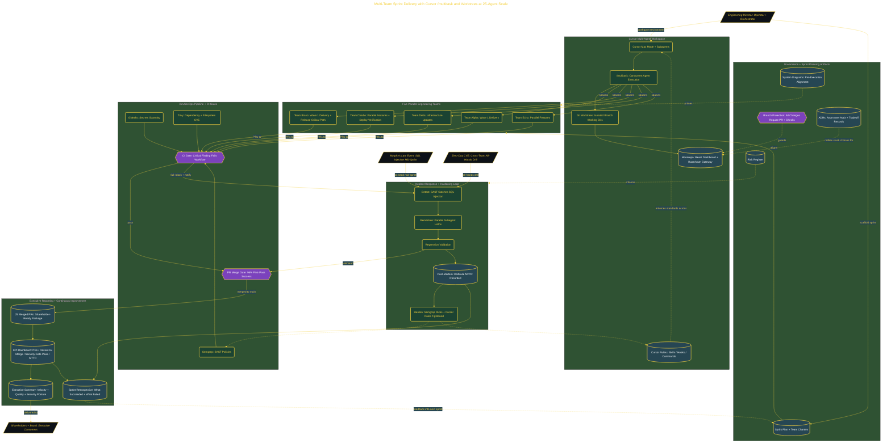

# Multi-Team Sprint Delivery with Cursor Subagents

> Inside the [Delivery Systems Engineering](../../README.md) portfolio · *Multi-project, multi-team customer engagements built to scale from one client to many.*

## Overview

A multi-team engineering sprint in which five parallel teams, 25 Cursor subagents total, deliver a shareholder-ready software package while running real DevSecOps and governance controls. The system answers a specific delivery question: *what does it take to keep status, security posture, and incident discipline coherent across multiple teams operating simultaneously, when AI is the throughput multiplier?*

The work is one engagement at compressed scale, but the **operating pattern is the building block for multi-engagement delivery**: `/multitask`-spawned subagents in isolated git worktrees per team, branch protection + CI gates that fail closed on Gitleaks / Semgrep / Trivy findings, ADRs that capture stack tradeoffs durably (e.g. Axum over Actix for the Rust gateway), and a KPI dashboard + executive summary that translates engineering execution into signal a board can act on. A mid-sprint Murphy's Law SQL-injection incident was contained in 8 minutes MTTR, and a Zero-Day CVE all-hands drill validated cross-team remediation under release-discipline pressure. The sprint produced 25 merged PRs at a 96% first-pass security-gate success rate, honestly recorded, not retroactively normalized.

The architecture below shows the delivery shape: Cursor Max Mode multi-agent workspace → governance + sprint planning artifacts → five parallel engineering teams via `/multitask` and worktrees → DevSecOps CI gates → incident-response and hardening loop → executive reporting + retrospective.

## Architecture

The diagram shows the topology and data flow of the system as built. The full architectural narrative, with screenshots and prose, lives in [`documents/multi-team-sprint-delivery.md`](./documents/multi-team-sprint-delivery.md).

## Implementation

This system is built across **8 phases**:

1. **Leading a 25-Engineer AI Organization**
2. **Establishing Governance and Branch Protection**
3. **Sprint Planning Artifacts and Architecture Decision Records**
4. **Configuring the Engineering Culture Layer and DevSecOps Pipeline**
5. **Delivering 25 PRs Through Parallel Sprint Execution**
6. **Responding to a Murphy's Law Security Incident**
7. **Delivering a Shareholder-Ready Executive Package**
8. **💎 Secret Mission: Zero-Day CVE All-Hands Incident Response**

For the full walkthrough with screenshots and step-by-step content, see [`documents/multi-team-sprint-delivery.md`](./documents/multi-team-sprint-delivery.md).

## Validation

Build outcomes verified end-to-end. Each phase below is captured with screenshots, configuration, and observable behavior in [`documents/multi-team-sprint-delivery.md`](./documents/multi-team-sprint-delivery.md):

- ✅ Leading a 25-Engineer AI Organization
- ✅ Establishing Governance and Branch Protection
- ✅ Sprint Planning Artifacts and Architecture Decision Records
- ✅ Configuring the Engineering Culture Layer and DevSecOps Pipeline
- ✅ Delivering 25 PRs Through Parallel Sprint Execution
- ✅ Responding to a Murphy's Law Security Incident
- ✅ Delivering a Shareholder-Ready Executive Package
- ✅ 💎 Secret Mission: Zero-Day CVE All-Hands Incident Response
